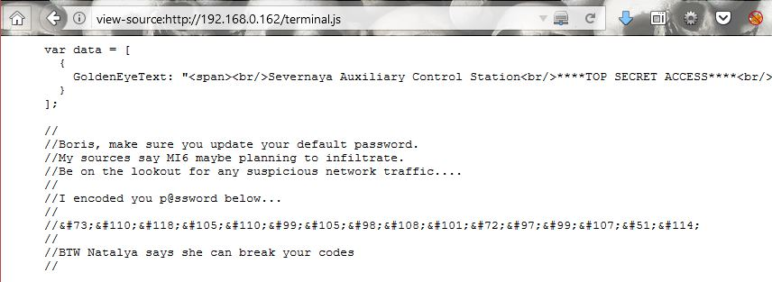
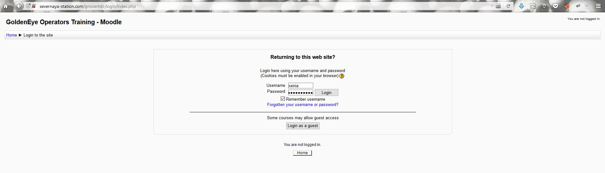

#**GoldenEye1** 
https://www.vulnhub.com/entry/goldeneye-1,240/

**level:** Intermediate

**Penetrating Methodologies:**

- Network scanning (Nmap)
- Surfing HTTP web services
- Fetched Encoded password
- Decoding (Burp suite)
- Brute-Force (Hydra)
- Connecting to pop3 (Netcat)
- Extracting password
- Adding domain Name (/etc/host)
- Exploring Domain Name over browser
- Brute-force (Hydra)
- Login to Server
- Exploiting Moodle (Metasploit)
- Kernel post Exploit (overlayfs)
- Capture the flag

**Let's start**

I started with simple nmap of the target to scan all open port. In my case, the IP address was 192.168.0.181.
1. $nmap -p- -A 192.168.0.162 --open

Our service scan identified an HTTP server running on port 80; so I explored target IP in the web browser. From here I got some clue for login page **/sev-home/** as you can see in the image above.

After that i went to check on its source code which lead me to another clue. Here i clicked on the **terminal.js** .

The terminal.js is used to put up the html code, I read the comment section and its gave me hint on a password which was encoded and two username; _**Boris**_ and _**Natalia**_ . pretty simple **:)**

I copied the above code and placed it on google search; upon finding this is what I obtain "**Invincible Hack3r**" **;D**
 ~~p/s: you can use HTML entities decoder to decode this~~
 
 
 
Browsing through the webpage showed that it has a pop3 service running and from early enumeration, there is two open port that currently running which were port 55006 and 55007. Hmm, that might be the pop3 service mention in this website. So i used nmap  version scan for them and found ssl/pop3 for 55006 and pop3 for 55007 along their version. woala, just as I suspected.

 
 
So after getting two usernames I applied brute-force for each users attack with help of following command:
1. $hydra -l boris -P /usr/share/wordlists/fasttrack.txt -f 192.168.0.162 -s 55007 pop3

 

That was it; **secret1!** for **boris** Now let's try to brute force **natalya**.

 
 
The password captured: **bird** for **natalya** as shown in the image. I should've guessed that. 
1. nc 192.168.0.162 55007

Afterward I accessed the pop3 mail using netcat command and found three messages in **boris** account while two messages in **natalya** account.

Ignored the fourth message ;D here is my finding that could gave me hints on the next step.

>Username: xenia

>Password: RCP90rulez!

>Domain name: /severnaya-station.com/

>Server directory: /gnocertdir

From the information above i need to point out my ip in the **/etc/hosts** configuration file so that i can use the internal server and direct to server directory mention above.

Woala, its moodle cms. This could lead to something. Lets login with the credential captured in **natalya** message. 

